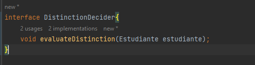
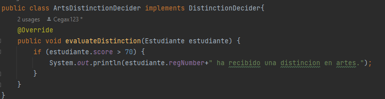
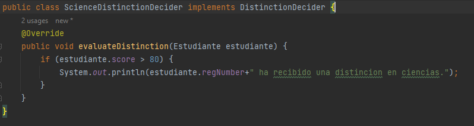

# PC3

---

## SRP

1. **Muestra la salida y explica los resultados en función de los métodos entregados**

    El resultado que se obtuvo es el siguiente:

    ```
    Demostracion sin SRP
    Nombre del empleado: Abejita,Jessica
    Este empleado tiene 7.5 años de experiencia.
    El ID del empleado es: J673
    Este empleado es un empleado senior
    
    ----
    
    Nombre del empleado: Smart,Chalito
    Este empleado tiene 3.2 años de experiencia.
    El ID del empleado es: C399
    Este empleado es un empleado junior
    ```
    
    Se muestran los datos de ambos empleados. Llamando a los tres métodos de `Empleado` para cada instancia.


   
2. **¿Cuál es el problema con este diseño y las razones posibles del problema?**
   
   - En cada ejecución el ID generado para un empleado será diferente. Por lo que tendríamos que definir una semilla o buscar otra solución.
   - Sea el caso en que tengamos 2 empleados con la misma inicial de nombre podríamos tener un mismo ID para ambos.
   - El método `checkSeniority()` retorna un string, lo cual es peligroso, pues podemos escribir `Senior` en vez de `senior` y nos referiremos a dos estados diferentes. Por lo cual deberíamos usar `enum`
   - Ambos métodos `checkSeniority()` y `generateEmpId()` deberían ser estáticos, pues no utilizan ningun atributo de la clase.
   
   Aparte de los problemas mencionados arriba, podemos observar que existen dos razones de cambio en nuestro módulo `Empleado`.
   - Si quiero modificar la forma de generación del ID del empleado
   - Si quiero modificar en `checkSeniority()` el umbral entre senior y junior
   
   Por lo que estamos violando el principio SRP.

3. **Modifica la clase Empleado**
   
   Modificando la clase Empleado...

4. **Realiza una demostración completa que sigue a SRP. Explica tus resultados**
   
   Después de realizar los cambios, tendremos a la clase `Empleado` como un contenedor de datos, y las dos nuevas clases contendrán una sola razón de cambio.
   De esta forma, se soluciona el problema y cumplimos con el principio SRP.

---
## OCP

5. **¿Por que no es correcto colocar displayResult() y evaluateDistinction() en la misma clase, como la siguiente:**
   
   Porque no cumpliria el principio ya analizado de SRP, esto porque `diplayResult()` y `evaluateDistinction()` pueden generar distintas razones de cambio.

6. **Muestra la salida y explica los resultados en función de los métodos entregados**
   
   El resultado que se obtuvo es el siguiente:
   
   ```
   Demostracion sin OCP
   Resultados:
   Nombre: Irene
   Numero Regex: R1
   Dept:Ciencia de la Computacion.
   Marks:81.5
   *******
   Nombre: Jessica
   Numero Regex: R2
   Dept:Fisica
   Marks:72.0
   *******
   Nombre: Chalo
   Numero Regex: R3
   Dept:Historia
   Marks:71.0
   *******
   Nombre: Claudio
   Numero Regex: R4
   Dept:Literatura
   Marks:66.5
   *******
   Distinciones:
   R1 ha recibido una distincion en ciencias.
   R3 ha recibido una distincion en artes.
   ```
      
   El resultado muestra primero cada estudiante enlistado con todos sus atributos, Luego se muestra las distinciones de cada estudiante en caso que haya logrado la puntuación requerida.
7. **¿Cuál es el problema con este diseño y las razones posibles del problema?**

   - Si queremos añadir estudiantes que tengan departamentos que pertenezcan a una nueva rama como por ejemplo "letras" tendriamos que modificar la clase `DistinctionDecider` añadiendo un nuevo atributo `List<String> Letters` que contenga los departamentos que pertenezcan a letras, tambien se tendria que modificar el metodo `evaluateDistinction()` añadiendo una nueva condicional 'if' para verificar si el estudiante es de letras.
   - Si queremos modificar el puntaje minimo de alguna rama para que un estudiante obtenga una distincion, se tendria que modificar directamente en el metodo `evaluateDistinction()` de la clase `DistinctionDecider` cambiando la condicional respectiva.
   - En la clase `DistinctionDecider` al identificar los departamentos de cada rama por sus nombres como Strings, lo cual es peligroso ya que hay alta probabilidad de error al tener el nombre de un departamento mal escrito.

   Como vemos al querer hacer estos cambios vamos que tener que hacer modificaciones de lineas de codigo en nuestra clase, por lo que estamos violando el principio OCP.

8. **Debes abordar el método de evaluación para la distinción de una mejor manera.
   Por lo tanto, crea la interfaz DistinctionDecider que contiene un método llamado
   EvaluationDistinction.**
   

9. **Completa el código de ArtsDistinctionDecider y ScienceDistinctionDecider que
   implementan esta interfaz y sobreescriben el método de evaluateDistinction(...) para
   especificar los criterios de evaluación según sus necesidades.**

   
   
10. **Realiza una demostración completa que sigue a OCP. Explica tus resultados**
    
   ```
   Demostracion OCP
   Resultados:
   Nombre: Irene
   Numero Reg: R1
   Dept:Ciencia de la computacion.
   Marks:81.5
   
   Nombre: Jessica
   Numero Reg: R2
   Dept:Fisica
   Marks:72.0
   
   Nombre: Chalo
   Numero Reg: R3
   Dept:Historia
   Marks:71.0
   
   Nombre: Claudio
   Numero Reg: R4
   Dept:Literatura
   Marks:66.5
   
   Distinciones:
   R1 ha recibido una distincion en ciencias.
   R3 ha recibido una distincion en artes.
   
   Process finished with exit code 0
   ```
    Después de ralizar los cambios tendremos una interfaz `DistinctionDecider` y la clase abstracta `Estudiante`, estos modulos abstraen los conceptos que usan en la clase `Cliente`.
      
    Este nuevo diseño permite una facil extension del software como por ejemplo nuevos departamentos y nuevas ramas para los estudiantes.
    
11. **¿Cuáles son las principales ventajas ahora?**
    - Si ahora quremos añadir una nueva rama como la de "letras" podemos simplemente crear una nueva clase `LetterDistinctionDecider` que implementaria la interfaz `DistinctionDecider`, asi como tambien creando una clase `LetrasEstudiante` que extiende a `Estudiante`,asi evitando cambiar lineas de codigo de alguna clase.
    - En general cualquier extension que querramos hacer sera solucionada gracias a la herencia y el polimorfismo.

## LSP

12. **Muestra la salida y explica los resultados en función de los métodos entregados**


   ```
    Recuperando de Abejita, ultimos detalles de pagos.
    ------
    Recuperando de Chalito, ultimos detalles de pagos.
    ------
    Procesando de Abejita, la actual solicitud de pagos .
    ------
    Procesando de Chalito, la actual solicitud de pagos .
    Process finished with exit code 0
   ```
   
   
   Instanciamos la clase PaymentHelper e Instanciamos la subclase heredada  de la interface Payment ,RegisteredUserPayment que a través de su constructor 
   asignamos el atributo Name como los son : “Abejita” y “Chalito” .
   Ahora añado dichos usuarios a la clase PaymentHelper a través de su método addUser
   Por último muestro el historial de pago y los pagos en proceso por los metodos showPreviousPayments y processNewPayments las cuales fueron Override
   de la interfaz de pagos .

13. 
14. **Dentro del método main(), utilizas una instancia de usuario invitado e intentas usar su clase auxiliar de la misma manera,¿ qué tipo de excepción te encuentras?¿Cuál es la solución?**
   
      Ya que la llamada al metodo de mostrar solicitud anterior para un usuario invitado es una opearcion incompatible se genera : Excepción de operación no admitida.

      Una solución sería evitar llamar a los invitados cuando vemos los pagos previos
    

15. 
16. **Modificación del codigo**
    

   
    
   
   ```
    Demostracion LSP.

    Recuperando de Irene, ultimos detalles de pagos.
    ------
    Recuperando de Claudio, ultimos detalles de pagos.
    ------
    Procesando de Irene, la actual solicitud de pagos .
    ------
    Procesando de Claudio, la actual solicitud de pagos .
    ------
    Procesando de guestpago actual request.
    ------   
   ```
17. **¿Cuáles son los cambios clave?**
    
    La creación de una nueva Interface para el caso de Usuarios invitados ,
       y la modificación de la clase auxiliar PaymentHelper lo que conlleva que la interface sea capaz de trabajar con cualquier subclase sin siquiera darse cuenta
       respetando LSP. 
