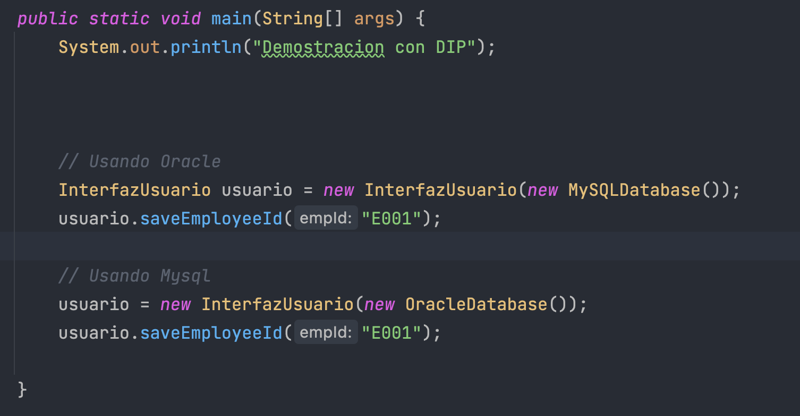
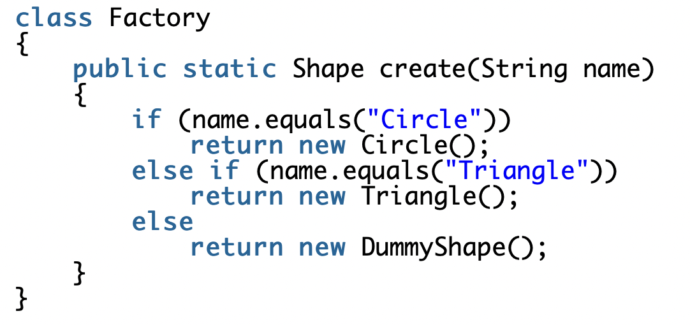
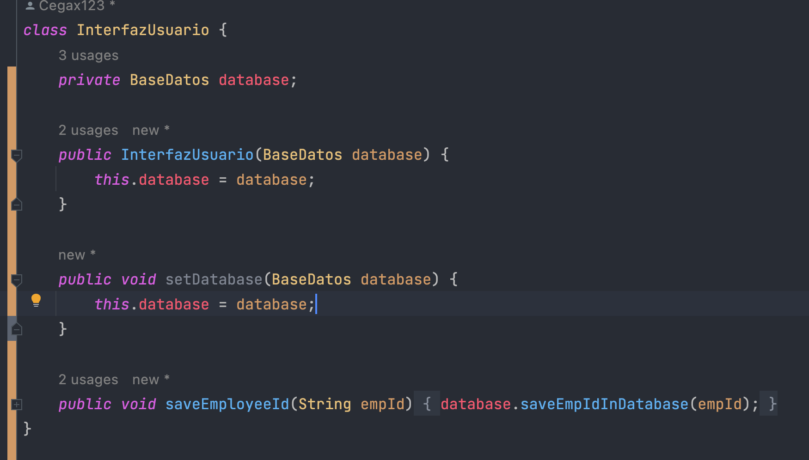

# PC3

---

## SRP

1. **Muestra la salida y explica los resultados en función de los métodos entregados**

    El resultado que se obtuvo es el siguiente:

    ```
    Demostracion sin SRP
    Nombre del empleado: Abejita,Jessica
    Este empleado tiene 7.5 años de experiencia.
    El ID del empleado es: J673
    Este empleado es un empleado senior
    
    ----
    
    Nombre del empleado: Smart,Chalito
    Este empleado tiene 3.2 años de experiencia.
    El ID del empleado es: C399
    Este empleado es un empleado junior
    ```
    
    Se muestran los datos de ambos empleados. Llamando a los tres métodos de `Empleado` para cada instancia.


   
2. **¿Cuál es el problema con este diseño y las razones posibles del problema?**
   
   - En cada ejecución el ID generado para un empleado será diferente. Por lo que tendríamos que definir una semilla o buscar otra solución.
   - Sea el caso en que tengamos 2 empleados con la misma inicial de nombre podríamos tener un mismo ID para ambos.
   - El método `checkSeniority()` retorna un string, lo cual es peligroso, pues podemos escribir `Senior` en vez de `senior` y nos referiremos a dos estados diferentes. Por lo cual deberíamos usar `enum`
   - Ambos métodos `checkSeniority()` y `generateEmpId()` deberían ser estáticos, pues no utilizan ningun atributo de la clase.
   
   Aparte de los problemas mencionados arriba, podemos observar que existen dos razones de cambio en nuestro módulo `Empleado`.
   - Si quiero modificar la forma de generación del ID del empleado
   - Si quiero modificar en `checkSeniority()` el umbral entre senior y junior
   
   Por lo que estamos violando el principio SRP.

3. **Modifica la clase Empleado**
   
   Modificamos los archivos `Empleado`, `GeneradorIDEmpleado`, `SeniorityChecker` y `Cliente` del package `Solid.SRP`

4. **Realiza una demostración completa que sigue a SRP. Explica tus resultados**
   
   Ahora tendremos que mover los dos métodos de la clase `Empleado` a una nueva clase cada uno. De esta forma, nos queda que la clase `Empleado` puede verse como un contenedor de datos (por lo cual, podríamos modificar el nombre de la clase a `EmpleadoData`, para una mejor comprensión).
   Y las dos nuevas clases solo tendrán una razón de cambio cada una, por lo cual nuestro sistema sigue a SRP.

   Por lo que, el método `showEmpDetail()` quedaría de la siguiente manera:
   

---
## OCP

5. **¿Por qué no es correcto colocar displayResult() y evaluateDistinction() en la misma clase, como la siguiente:**
   
   Porque no cumpliría el principio ya analizado de SRP, esto porque `diplayResult()` y `evaluateDistinction()` pueden generar distintas razones de cambio.

6. **Muestra la salida y explica los resultados en función de los métodos entregados**
   
   El resultado que se obtuvo es el siguiente:
   
   ```
   Demostracion sin OCP
   Resultados:
   Nombre: Irene
   Numero Regex: R1
   Dept:Ciencia de la Computacion.
   Marks:81.5
   *******
   Nombre: Jessica
   Numero Regex: R2
   Dept:Fisica
   Marks:72.0
   *******
   Nombre: Chalo
   Numero Regex: R3
   Dept:Historia
   Marks:71.0
   *******
   Nombre: Claudio
   Numero Regex: R4
   Dept:Literatura
   Marks:66.5
   *******
   Distinciones:
   R1 ha recibido una distincion en ciencias.
   R3 ha recibido una distincion en artes.
   ```
      
   El resultado muestra primero cada estudiante enlistado con todos sus atributos, Luego se muestra las distinciones de cada estudiante en caso que haya logrado la puntuación requerida.
7. **¿Cuál es el problema con este diseño y las razones posibles del problema?**

   - Si queremos añadir estudiantes que tengan departamentos que pertenezcan a una nueva rama como por ejemplo "letras" tendriamos que modificar la clase `DistinctionDecider` añadiendo un nuevo atributo `List<String> Letters` que contenga los departamentos que pertenezcan a letras, tambien se tendria que modificar el metodo `evaluateDistinction()` añadiendo una nueva condicional 'if' para verificar si el estudiante es de letras.
   - Si queremos modificar el puntaje minimo de alguna rama para que un estudiante obtenga una distincion, se tendria que modificar directamente en el metodo `evaluateDistinction()` de la clase `DistinctionDecider` cambiando la condicional respectiva.
   - En la clase `DistinctionDecider` al identificar los departamentos de cada rama por sus nombres como Strings, lo cual es peligroso ya que hay alta probabilidad de error al tener el nombre de un departamento mal escrito.

   Como vemos al querer hacer estos cambios vamos que tener que hacer modificaciones de lineas de codigo en nuestra clase, por lo que estamos violando el principio OCP.

8. **Debes abordar el método de evaluación para la distinción de una mejor manera.
   Por lo tanto, crea la interfaz DistinctionDecider que contiene un método llamado
   EvaluationDistinction.**
   

9. **Completa el código de ArtsDistinctionDecider y ScienceDistinctionDecider que
   implementan esta interfaz y sobreescriben el método de evaluateDistinction(...) para
   especificar los criterios de evaluación según sus necesidades.**

   
   
10. **Realiza una demostración completa que sigue a OCP. Explica tus resultados**
    
   ```
   Demostracion OCP
   Resultados:
   Nombre: Irene
   Numero Reg: R1
   Dept:Ciencia de la computacion.
   Marks:81.5
   
   Nombre: Jessica
   Numero Reg: R2
   Dept:Fisica
   Marks:72.0
   
   Nombre: Chalo
   Numero Reg: R3
   Dept:Historia
   Marks:71.0
   
   Nombre: Claudio
   Numero Reg: R4
   Dept:Literatura
   Marks:66.5
   
   Distinciones:
   R1 ha recibido una distincion en ciencias.
   R3 ha recibido una distincion en artes.
   
   Process finished with exit code 0
   ```
    Después de realizar los cambios tendremos una interfaz `DistinctionDecider` y la clase abstracta `Estudiante`, estos módulos abstraen los conceptos que usan en la clase `Cliente`.
      
    Este nuevo diseño permite una fácil extension del software como por ejemplo nuevos departamentos y nuevas ramas para los estudiantes.
    
11. **¿Cuáles son las principales ventajas ahora?**
    - Si ahora queremos añadir una nueva rama como la de "letras" podemos simplemente crear una nueva clase `LetterDistinctionDecider` que implementaría la interfaz `DistinctionDecider`, asi como también creando una clase `LetrasEstudiante` que extiende a `Estudiante`, así evitando cambiar líneas de código de alguna clase.
    - En general cualquier extension que queramos hacer será solucionada gracias a la herencia y el polimorfismo.

---

## LSP

12. **Muestra la salida y explica los resultados en función de los métodos entregados**


   ```
    Recuperando de Abejita, ultimos detalles de pagos.
    ------
    Recuperando de Chalito, ultimos detalles de pagos.
    ------
    Procesando de Abejita, la actual solicitud de pagos .
    ------
    Procesando de Chalito, la actual solicitud de pagos .
    Process finished with exit code 0
   ```
   
   
   Instanciamos la clase PaymentHelper e Instanciamos la subclase heredada  de la interface Payment ,RegisteredUserPayment que a través de su constructor 
   asignamos el atributo Name como los son : “Abejita” y “Chalito” .
   Ahora añado dichos usuarios a la clase PaymentHelper a través de su método addUser
   Por último muestro el historial de pago y los pagos en proceso por los metodos showPreviousPayments y processNewPayments las cuales fueron Override
   de la interfaz de pagos .

13. 
14. **Dentro del método main(), utilizas una instancia de usuario invitado e intentas usar su clase auxiliar de la misma manera, ¿qué tipo de excepción te encuentras?¿Cuál es la solución?**
   
      Ya que la llamada al método de mostrar solicitud anterior para un usuario invitado es una operación incompatible se genera: Excepción de operación no admitida.

      Una solución sería evitar llamar a los invitados cuando vemos los pagos previos
    

15. 
16. **Modificación del codigo**
    

   
    
   
   ```
    Demostracion LSP.

    Recuperando de Irene, ultimos detalles de pagos.
    ------
    Recuperando de Claudio, ultimos detalles de pagos.
    ------
    Procesando de Irene, la actual solicitud de pagos .
    ------
    Procesando de Claudio, la actual solicitud de pagos .
    ------
    Procesando de guestpago actual request.
    ------   
   ```
17. **¿Cuáles son los cambios clave?**
    
    La creación de una nueva Interface para el caso de Usuarios invitados ,
       y la modificación de la clase auxiliar PaymentHelper lo que conlleva que la interface sea capaz de trabajar con cualquier subclase sin siquiera darse cuenta
       respetando LSP. 
   
18. **Podria realiza una modificación donde utilizas un método estático para mostrar todas las solicitudes de pago
    y utilizar este método siempre que lo necesites**
    
    Notamos que el metodo llama a un atributo `name` no estatico por ello el metodo no 
    puede ser estatico.

    
---

## ISP

19. **Escribe una jerarquía de fax que puede parecerse a la siguiente**

   El resultado sería el siguiente

   
   
20. **Explica el problema**

    Como tenemos que pasar como parámetro el tipo de Fax, entonces tendremos que modificar el método `sendFax` de la interface `Impresora`. Esto conlleva a que tengamos que modificar el método `sendFax` de la clase concreta `ImpresoraBasica`. Es decir, estamos modificando una clase por una razón que no debería depender de ella, en este caso el método `sendFax`.

21. **Si has entendido correctamente el problema. El ISP te sugiere que te ocupes de este tipo de escenario. Explica tu respuesta.**

      Como el ISP indica, tendríamos que dividir ambos métodos de la interfaz `Impresora` en dos nuevas interfaces. La `ImpresoraAvanzada` implementaría ambas interfaces, mientras que la `ImpresoraBasica` implementaría solo el método que necesita en este caso.

22. **¿Es conveniente usar e inicializar el siguiente código?**
   
      Como mencionamos en la respuesta de la pregunta 21, si inicializamos de esa manera se violaría el principio ISP, puesto que `ImpresoraBasica` tendría un método que no utiliza.

23.  
24. **Comprueba tus respuestas añadiendo dentro de main(), el siguiente código
    polimórfico:**

   
   
   
   

25. **Reemplaza el segmento de código con una expresión lambda adecuada. Tú eliges cuál quieres usar.**
    

    


26.**Muestra la salida y explica los resultados en función de los métodos entregados.**
    
27. 
28. **¿Qué sucede si usa un método predeterminado dentro de la interfaz?**
    

    Al implementar un método por default aseguramos que las subclases implementadas
    obtienen dicha implementación del método , es decir todas las clases compartirán
    dicho método a menos que se override para un método en específico.


29. **¿Qué sucede si proporcionas un método de fax predeterminado en una interfaz?**

    Viste el problema potencial : Todas nuestras clases implementadas de la interfaz tendrán el método por default
    , ahora si queremos un conjunto de clases que tengan un diferente implementación de este método
    tendríamos que override dicho método para cada uno de ellos , lo cual genera duplicación de código.


30. **¿Qué sucede si usa un método vacío, en lugar de lanzar la excepción?**
    La ejecución del código no me generaría "Excepción de operación no admitida" sin embargo la clase `ImpresoraBasica`
    podría usar el método `Sendfax` ,  violando el principio ISP y las especificaciones establecidas.

## DIP

31. **Muestra la salida y explica los resultados en función de los métodos entregados**

    Se obtuvo el siguiente resultado

    

    Se crea una instancia de la clase `InterfazUsuario`, y llamamos al método `saveEmployeeId()` el cual guarda el ID del usuario en una base de datos. En este caso, como la clase `OracleDatabase` es concreta, es una base de datos Oracle.

32. **El programa es simple, pero ¿qué tipo de problemas presenta?**

    Estamos violando el principio DIP, pues la clase de alto nivel `InterfazUsuario` depende de la clase de bajo nivel `OracleDatabase`. Esto me genera problemas como:
    - Si realizo cambios en la implementación de la clase `OracleDatabase`, la clase `InterfazUsuario` se puede ver afectada.
    - Además, solamente este código funciona cuando la base de datos es Oracle, por lo que no es fácilmente reusable.

33. Implementamos `InterfazUsuario` que ahora dependerá de una interface `BaseDatos`
    
    

34. Completamos todos los archivos. La clase `Cliente` quedaría de la siguiente manera:
    

    Y obtenemos el siguiente resultado al ejecutar este código:
    ```
    Demostracion con DIP
    El id: E001 es guardado en la base de datos MySQL.
    El id: E001 es guardado en la base de datos Oracle.
    ```

    Con esto, la clase `InterfazUsuario` ya no depende de una clase de bajo nivel. Ahora nuestro código sigue el principio DIP.
    Además, podemos fácilmente añadir nuevas bases de datos sin el riesgo de tener que modificar nuestra clase `InterfazUsuario` (OCP).

35. **Encuentra alguna excepción a esta sugerencia**
    Una forma usual de implementar el patron de diseño `Factory` es de la siguiente manera:
    

    Donde podemos ver que una clase de alto nivel depende de clases de bajo nivel.
36. **Método setter `setDatabase()`**
    

    Anteriormente, para poder usar diferentes tipos de base de datos, teníamos que crear un nuevo objeto de la clase `InterfazUsuario` y definirlo en el constructor. Pero, ¿qué sucedería si quiero mantener algunos atributos en esa clase y solo cambiar la base de datos?
    Para ello codificamos el setter que nos permitirá cambiar la base de datos en cualquier momento que lo requiramos.
    
    