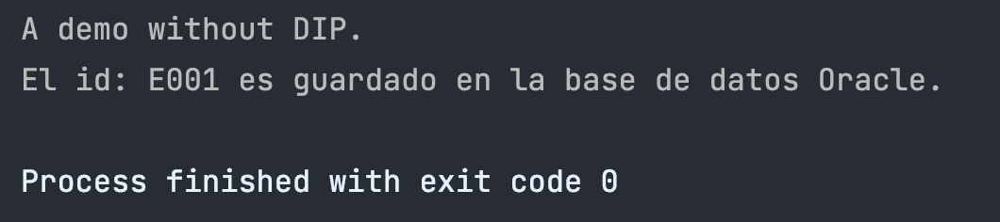
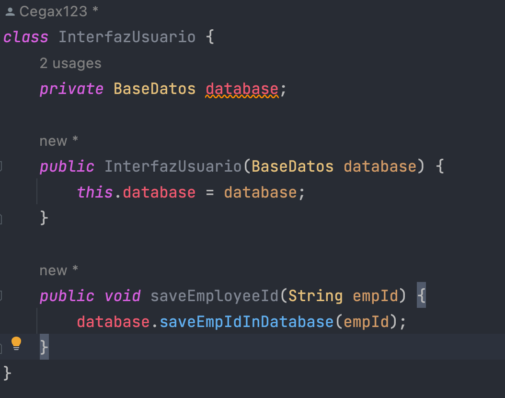
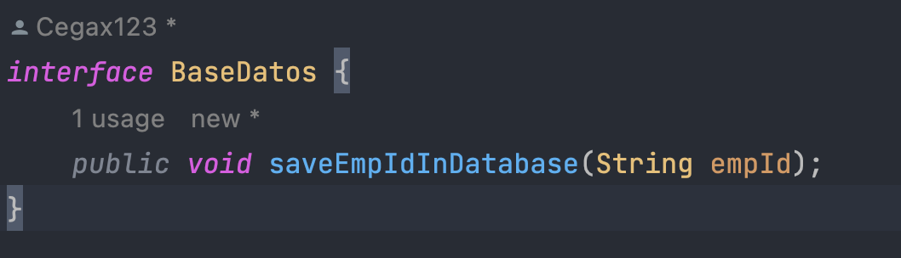
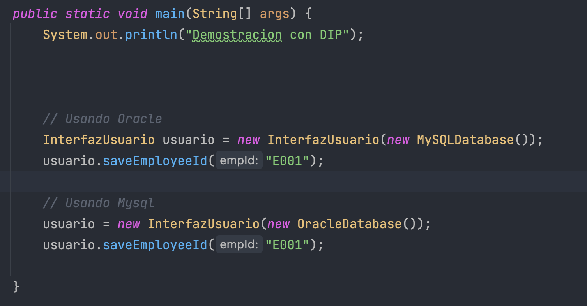
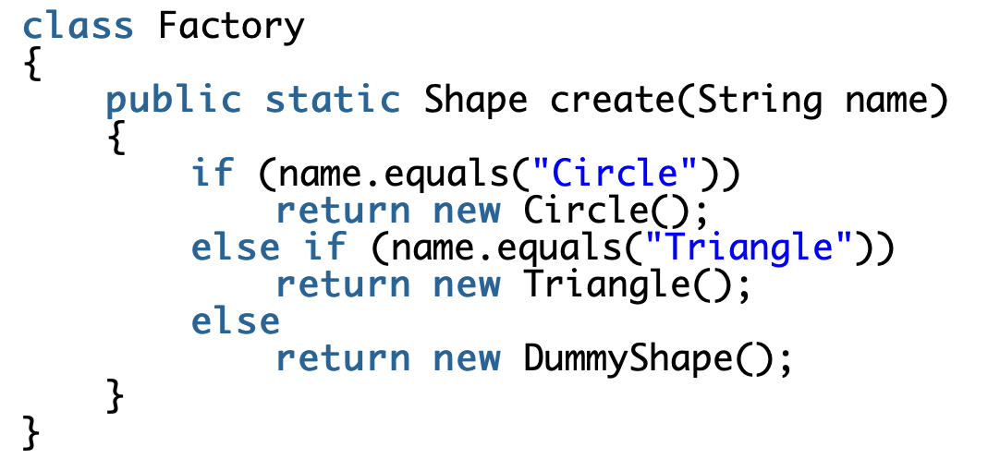
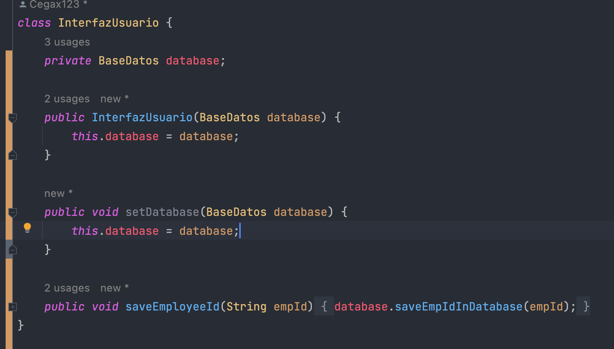

## DIP

31. **Muestra la salida y explica los resultados en función de los métodos entregados**

    Se obtuvo el siguiente resultado

    

    Se crea una instancia de la clase `InterfazUsuario`, y llamamos al método `saveEmployeeId()` el cual guarda el ID del usuario en una base de datos. En este caso, como la clase `OracleDatabase` es concreta, es una base de datos Oracle.

32. **El programa es simple, pero ¿qué tipo de problemas presenta?**

    Estamos violando el principio DIP, pues la clase de alto nivel `InterfazUsuario` depende de la clase de bajo nivel `OracleDatabase`. Esto me genera problemas como:
    - Si realizo cambios en la implementación de la clase `OracleDatabase`, la clase `InterfazUsuario` se puede ver afectada.
    - Además, solamente este código funciona cuando la base de datos es Oracle, por lo que no es fácilmente reusable.

33. Implementamos `InterfazUsuario` que ahora dependerá de una interface `BaseDatos`
    
    

34. Completamos todos los archivos. La clase `Cliente` quedaría de la siguiente manera:
    

    Y obtenemos el siguiente resultado al ejecutar este código:
    ```
    Demostracion con DIP
    El id: E001 es guardado en la base de datos MySQL.
    El id: E001 es guardado en la base de datos Oracle.
    ```
    
    Con esto, la clase `InterfazUsuario` ya no depende de una clase de bajo nivel. Ahora nuestro código sigue el principio DIP.
    Además, podemos fácilmente añadir nuevas bases de datos sin el riesgo de tener que modificar nuestra clase `InterfazUsuario` (OCP).

35. **Encuentra alguna excepción a esta sugerencia**
    Una forma usual de implementar el patron de diseño `Factory` es de la siguiente manera:
    
    
    Donde podemos ver que una clase de alto nivel depende de clases de bajo nivel.
36. **Método setter `setDatabase()`**
    

    Anteriormente, para poder usar diferentes tipos de base de datos, teníamos que crear un nuevo objeto de la clase `InterfazUsuario` y definirlo en el constructor. Pero, ¿qué sucedería si quiero mantener algunos atributos en esa clase y solo cambiar la base de datos?
    Para ello codificamos el setter que nos permitirá cambiar la base de datos en cualquier momento que lo requiramos.
    